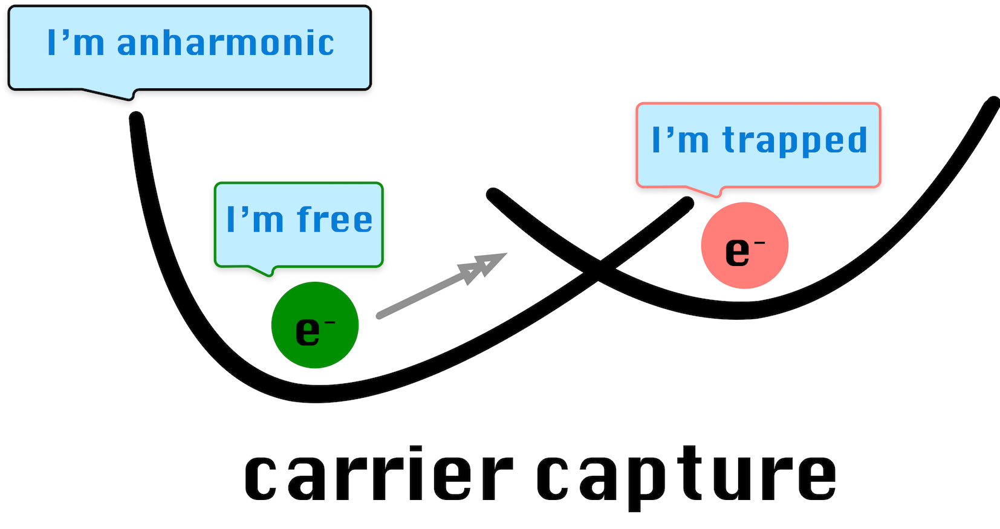
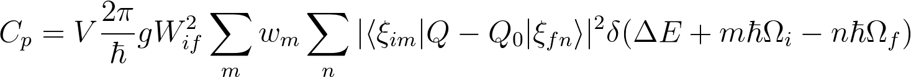

[](https://opensource.org/licenses/MIT)
[](https://julialang.org)
[](https://wmd-group.github.io/CarrierCapture.jl/dev/)
[](https://github.com/WMD-group/CarrierCapture.jl/actions/workflows/ci.yml)
[](https://zenodo.org/badge/latestdoi/130691083)
[](https://doi.org/10.21105/joss.02102)
[](https://julialang.org)

<center>

</center>

A set of codes to compute carrier capture and non-radiative recombination rates associated with point defects in semiconducting compounds.
Multiphonon process involving impurities has a rich history starting from the work by [Huang and Rhys](http://rspa.royalsocietypublishing.org/content/204/1078/406.short).
Our implementation was inspired by the approach (and FORTRAN code) employed by [Alkauskas and coworkers](https://journals.aps.org/prb/abstract/10.1103/PhysRevB.90.075202), but has been adapted
to also describe anharmonic potential energy surfaces.

## Installation

The codes are written in [Julia](https://julialang.org), while the scripts and [Jupyter Notebooks](http://jupyter.org) also contain [Python](https://www.python.org) and use [pymatgen](http://pymatgen.org) and [pawpyseed](https://github.com/kylebystrom/pawpyseed), which are assumed to be installed.
The [Brooglie](https://github.com/RedPointyJackson/Brooglie) package is used to solve the time-independent Schrödinger equation.

Install the package by:

```julia
julia> using Pkg

julia> Pkg.add(PackageSpec(url="https://github.com/WMD-group/CarrierCapture.jl.git"))
```

To run the unit tests for the package, use the `Pkg.test` function. 

```julia
julia> Pkg.test("CarrierCapture")
```

## Development

The project is hosted on [Github](https://github.com/WMD-group/carriercapture).
Please use the [issue tracker](https://github.com/WMD-group/carriercapture/issues/) for feature requests, bug reports and more general questions.
If you would like to contribute, please do so via a pull request.

## Usage

A typical workflow consists of several steps, implemented in a series of programs, which may be run from the command line. Input for the calculations is provided in `input.yaml`.

 0. Prepare a sequence of atomic structure models with displacements that interpolate between two defect configurations (e.g. a site vacancy in charge states q=0 and q=+1).
    Run single-point energy calculations on these structures, and extract the total energies. Scripts for preprocessing may be found in `script`.

 1. Find a best fit for the energy calculations of the deformed structures (`potential`) to generate potential energy surfaces (PES).
    Solve the 1D Schrödinger equation for each PES to obtain their phonon (nuclear) wavefunctions.

 3. Construct configuration coordinate (`conf_coord`) to calculate the wavefunction overlap between each PES, 
    which forms part of the temperature-dependent capture coefficient.


The command-line interface (`GetPotential.jl` and `GetRate.jl`) is depreciated.
Use [Jupyter Notebook](http://jupyter.org) [examples](https://github.com/WMD-group/CarrierCapture.jl/blob/master/example/notebook/) as a template.

_User warning:_ The values produced by this type of analysis procedure are sensitive to the quality of the input. 
We expect that most input data will have been generated by DFT where the basis set, k-points, and ionic forces have been carefully converged.
In addition, the alignment of energy surfaces for defects in different charge states requires appropriate finite-size corrections (e.g. see [Freysoldt and coworkers](https://journals.aps.org/rmp/abstract/10.1103/RevModPhys.86.253) and consider using the [doped](https://github.com/SMTG-Bham/doped) package).

## Examples

The following examples are provided to illustrate some of the applications of these codes. The input data has been generated from density functional theory (DFT) using [VASP](https://www.vasp.at), but the framework can easily be adapted to accept output from other electronic structure calculators. 

* [Sn<sub>Zn</sub> in Cu<sub>2</sub>ZnSnS<sub>4</sub>](./example/notebook/Harmonic%20(Sn_Zn).ipynb): Harmonic approximation

* [DX-center in GaAs](./example/notebook/Anharmonic%20(DX%20center).ipynb): Anharmonic fitting

* [Electron-phonon coupling](./example/notebook/e-ph.ipynb): Electron-phonon coupling matrix element

## Theory

> The electronic matrix element frequently causes feelings of discomfort (Stoneham, 1981)

The capture of electrons or holes by point defects in a crystalline materials requires the consideration of a number of factors including the coupling between electronic and vibrational degrees of freedom. Many theories and approximations have been developed to describe the reaction kinetics.

The capture coefficient between an initial and final state for this computational set up is given by (eq. 22 in [Alkauskas and coworkers](https://journals.aps.org/prb/abstract/10.1103/PhysRevB.90.075202)):

<center>

</center>

Here, *V* is the volume of the supercell, *W<sub>if</sub>* is the electron-phonon overlap and *ξ<sub>im</sub>* and *ξ<sub>fn</sub>* describe the wavefunctions of the *m<sup>th</sup>* and *n<sup>th</sup>* phonons in the initial *i* and final *f* states. The final delta-function term serves to conserve energy and in practice is replaced by a smearing Gaussian of finite width *σ*.

## Citation
```
@article{kim2020carriercapture,
  title={Carriercapture. jl: Anharmonic carrier capture},
  author={Kim, Sunghyun and Hood, Samantha N and van Gerwen, Puck and Whalley, Lucy D and Walsh, Aron},
  journal={Journal of Open Source Software},
  volume={5},
  number={47},
  pages={2102},
  year={2020},
  doi={10.21105/joss.02102},
  url={https://joss.theoj.org/papers/10.21105/joss.02102},
}
```

## Extended Reading List

#### Theory Development

* [Henry and Lang, Nonradiative capture and recombination by multiphonon emission in GaAs and GaP (1977)](https://journals.aps.org/prb/pdf/10.1103/PhysRevB.15.989)
*Seminal contribution that introduces many important concepts*

* [Huang, Adiabatic approximation theory and static coupling theory of nonradiative transition (1981)](https://www.worldscientific.com/doi/epdf/10.1142/9789812793720_0009)
*Context for the static approximation that we employ*

* [Stoneham, Non-radiative transitions in semiconductors (1981)](http://iopscience.iop.org/article/10.1088/0034-4885/44/12/001/meta)
*Review on theory and various models of recombination*

* [Markvart, Determination of potential surfaces from multiphonon transition rates (1981)](http://iopscience.iop.org/article/10.1088/0022-3719/14/15/002)
*Discussion and treatment of anharmonicity*

* [Markvart, Semiclassical theory of non-radiative transitions (1981)](http://iopscience.iop.org/article/10.1088/0022-3719/14/29/006/meta)
*Semiclassical treatment of matrix elements following Landau and Holstein*

#### Applications of CarrierCapture

* [Kavanagh et al, Intrinsic point defect tolerance in selenium for indoor and tandem photovoltaics (2025)](https://pubs.rsc.org/en/content/articlelanding/2025/ee/d4ee04647a)

* [López et al, Chalcogen Vacancies Rule Charge Recombination in Pnictogen Chalcohalide Solar-Cell Absorbers (2025)](https://arxiv.org/abs/2504.18089)

* [Wang et al, Sulfur Vacancies Limit the Open-Circuit Voltage of Sb₂S₃ Solar Cells (2024)](https://pubs.acs.org/doi/full/10.1021/acsenergylett.4c02722)

* [Wang et al, Upper efficiency limit of Sb<sub>2</sub>Se<sub>3</sub> solar cells (2024)](https://doi.org/10.1016/j.joule.2024.05.004)

* [Kavanagh et al, Impact of metastable defect structures on carrier recombination in solar cells (2022)](https://pubs.rsc.org/en/content/articlelanding/2022/fd/d2fd00043a)

* [Kavanagh et al, Rapid recombination by cadmium vacancies in CdTe (2021)](https://doi.org/10.1021/acsenergylett.1c00380)

* [Whalley et al, Giant Huang–Rhys factor for electron capture by the iodine intersitial in perovskite solar cells (2021)](https://pubs.acs.org/doi/full/10.1021/jacs.1c03064)

* [Kim and Walsh, Ab initio calculation of the detailed balance limit to the photovoltaic efficiency of single p-n junction kesterite solar cells (2021)](https://aip.scitation.org/doi/10.1063/5.0049143) 

* [Dahliah et al, High-throughput computational search for high carrier lifetime, defect-tolerant solar absorbers (2021)](https://pubs.rsc.org/en/content/articlelanding/2021/EE/D1EE00801C)

* [Kim et al, Upper limit to the photovoltaic efficiency of imperfect crystals (2020)](https://dx.doi.org/10.1039/D0EE00291G) 

* [Kim et al, Anharmonic lattice relaxation during non-radiative carrier capture (2019)](https://journals.aps.org/prb/abstract/10.1103/PhysRevB.100.041202) 

* [Kim et al, Lone-pair effect on carrier capture in Cu<sub>2</sub>ZnSnS<sub>4</sub> solar cells (2019)](https://pubs.rsc.org/en/content/articlehtml/2019/ta/c8ta10130b)

* [Kim et al, Identification of killer defects in kesterite thin-film solar cells (2018)](https://pubs.acs.org/doi/abs/10.1021/acsenergylett.7b01313)
