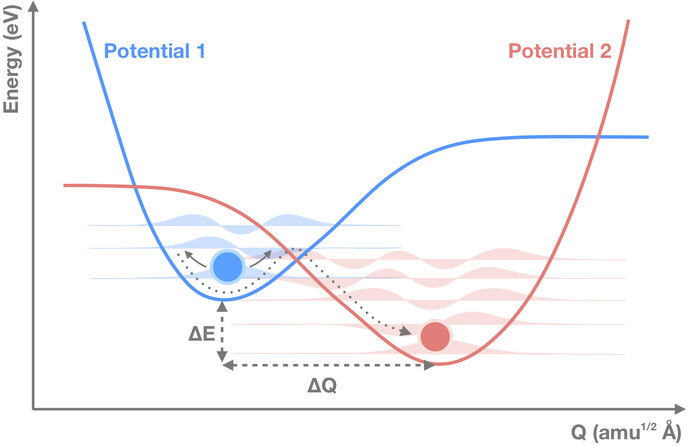

[](https://opensource.org/licenses/MIT)
[](https://julialang.org)
[](https://travis-ci.com/WMD-group/CarrierCapture.jl)
[](https://codecov.io/gh/WMD-group/CarrierCapture.jl)
[](https://zenodo.org/badge/latestdoi/130691083)

<center>

</center>

A set of codes to compute carrier capture and recombination rates in semiconducting compounds.
This topic has a rich history starting from the work by [Huang and Rhys](http://rspa.royalsocietypublishing.org/content/204/1078/406.short).
Our implementation was inspired by the approach (and FORTRAN code) employed by [Alkauskas and coworkers](https://journals.aps.org/prb/abstract/10.1103/PhysRevB.90.075202), but has been adapted
to also describe anharmonic potential energy surfaces.

## Installation

The codes are written in [Julia](https://julialang.org), while the scripts and [Jupyter Notebooks](http://jupyter.org) also contain [Python](https://www.python.org) and use [pymatgen](http://pymatgen.org), which are assumed to be installed.
The [Brooglie](https://github.com/RedPointyJackson/Brooglie) package is used to solve the time-independent Schrödinger equation.
The dependencies can be installed by:

`Pkg.add(PackageSpec(url="https://github.com/RedPointyJackson/Brooglie"))`

Install the package by:

`Pkg.add("https://github.com/WMD-group/CarrierCapture.jl.git")`.

Add `/cli` in to your `PATH` so that you can use `GetPotential.jl` and `GetRate.jl` in your work directory.

```bash
$ julia

julia> using CarrierCapture
julia> pathof(CarrierCapture)
"<YOUR_PATH_TO_PACKAGE>/src/CarrierCapture.jl"

$ export PATH=<YOUR_PATH_TO_PACKAGE>/cli;$PATH
```

## Development

The project is hosted on [Github](https://github.com/WMD-group/carriercapture).
Please use the [issue tracker](https://github.com/WMD-group/carriercapture/issues/) for feature requests, bug reports and more general questions.
If you would like to contribute, please do so via a pull request.

## Usage

A typical workflow will consist of several steps, implemented in a series of short programs, which may be run from the command line. Input for the calculations is provided in `input.yaml`.

1. Prepare a sequence of atomic structure models with displacements that interpolate between two defect configurations (e.g. a site vacancy in charge states q=0 and q=+1).
Run single-point energy calculations on these structures, and extract the total energies. Scripts for preprocessing may be found in [script](./script/).

2. Generate configuration coordinate diagrams with fits to the two potential energy surfaces (PES) using `GetPotential.jl`.
Solve the 1D Schrödinger equation for each PES to obtain their phonon (nuclear) wavefunctions.

<center>

</center>

3. Calculate the wavefunction overlap between each PES, which forms part of the temperature-dependent capture coefficient that is obtained using `GetRate.jl`.

## Examples

The following examples are provided to illustrate some of the applications of these codes. The input data has been generated from density functional theory (DFT) using [VASP](https://www.vasp.at), but the framework can easily be adapted to accept output from other electronic structure calculators. 

* [Sn<sub>Zn</sub> in Cu<sub>2</sub>ZnSnS<sub>4</sub>](./example/Sn_Zn_CZTS): Harmonic approximation

* [DX-center in GaAs](./example/DX-center): Anharmonic fitting

## Theory

> The electronic matrix element frequently causes feelings of discomfort (Stoneham, 1981)

The capture of electrons or holes by point defects in a crystalline materials requires the consideration of a number of factors including the coupling between electronic and vibrational degrees of freeedom. Many theories and approximations have been developed to describe the reaction kinetics.

The capture coefficient between an initial and final state for this computational set up is given by (eq. 22 in [Alkauskas and coworkers](https://journals.aps.org/prb/abstract/10.1103/PhysRevB.90.075202)):

<a href="https://www.codecogs.com/eqnedit.php?latex=\dpi{300}&space;C_p&space;=&space;V&space;\frac{2\pi}{\hbar}&space;g&space;W_{if}^2&space;\sum_m&space;w_m&space;\sum_n&space;|\langle&space;\xi_{im}|&space;Q&space;-&space;Q_0&space;|&space;\xi_{fn}\rangle|^2&space;\delta(\Delta&space;E&space;&plus;&space;m\hbar\Omega_i&space;-n\hbar\Omega_f)" target="_blank"></a>

Here, *V* is the volume of the supercell, *W<sub>if</sub>* is the electron-phonon overlap and *ξ<sub>im</sub>* and *ξ<sub>fn</sub>* describe the wavefunctions of the *m<sup>th</sup>* and *n<sup>th</sup>* phonons in the initial *i* and final *f* states. The final delta-function term serves to conserve energy and in practice is replaced by a smearing Gaussian of finite width *σ*.

### User Warning

The values produced by this type of analysis procedure are sensitive to the quality of the input. 
We expect that most input data will have been generated by DFT where the basis set, k-points, and ionic forces have been carefully converged.
In addition, the alignment of energy surfaces for defects in different charge states requires appropriate finite-size corrections (e.g. see [Freysoldt and coworkers](https://journals.aps.org/rmp/abstract/10.1103/RevModPhys.86.253)).

### Extended Reading List

#### Theory Development

* [Heny and Lang, Nonradiative capture and recombination by multiphonon emission in GaAs and GaP (1977)](https://journals.aps.org/prb/pdf/10.1103/PhysRevB.15.989)
*Seminal contribution that introduces many important concepts*

* [Huang, Adiabatic approximation theory and static coupling theory of nonradiative transition (1981)](http://engine.scichina.com/doi/10.1360/ya1981-24-1-27)
*Context for the static approximation that we employ*

* [Stoneham, Non-radiative transitions in semiconductors (1981)](http://iopscience.iop.org/article/10.1088/0034-4885/44/12/001/meta)
*Review on theory and various models of recombination*

* [Markvart, Determination of potential surfaces from multiphonon transition rates (1981)](http://iopscience.iop.org/article/10.1088/0022-3719/14/15/002)
*Discussion and treatment of anharmonicity*

* [Markvart, Semiclassical theory of non-radiative transitions (1981)](http://iopscience.iop.org/article/10.1088/0022-3719/14/29/006/meta)
*Semiclassical treatment of matrix elements following Landau and Holstein*

#### Applications

* [Kim et al, Lone-pair effect on carrier capture in Cu<sub>2</sub>ZnSnS<sub>4</sub> solar cells (2019)](https://pubs.rsc.org/en/content/articlehtml/2019/ta/c8ta10130b)

* [Kim et al, Identification of killer defects in kesterite thin-film solar cells (2018)](https://pubs.acs.org/doi/abs/10.1021/acsenergylett.7b01313)

* [Wickramaratne et al, Iron as a source of efficient Shockley-Read-Hall recombination in GaN (2016)](https://aip.scitation.org/doi/abs/10.1063/1.4964831)
