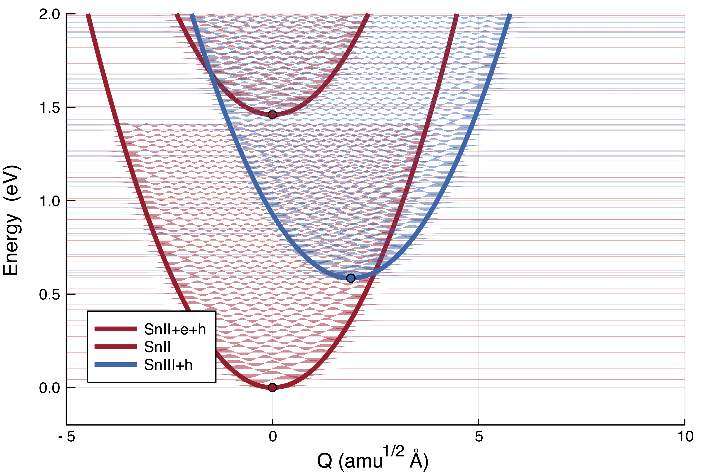
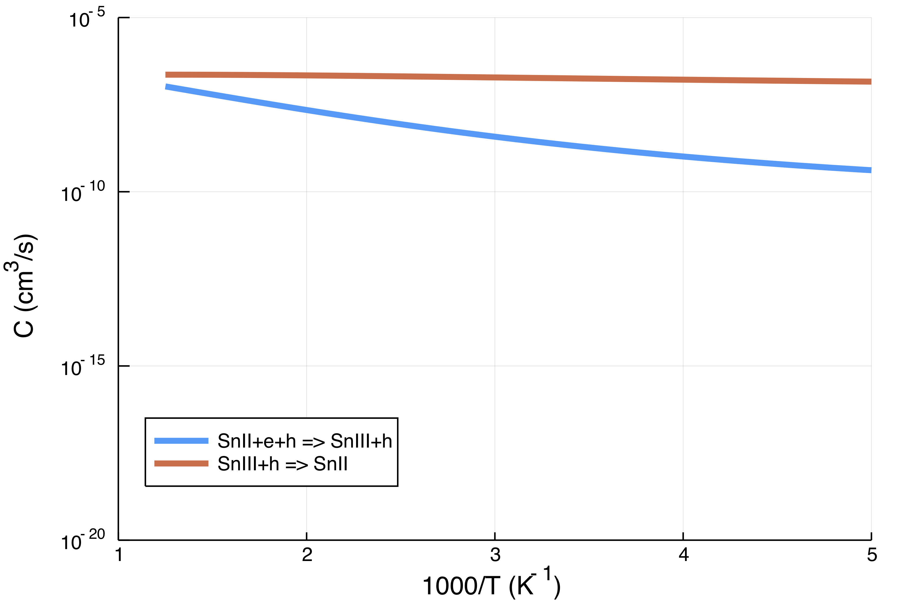

# Usage

A typical usage will consist of about three steps, implemented in a series of short programs which may be run from the command line. Input for the calculations is provided in `input.yaml`.

## 1. Preparation

Before `CarrierCapture`, you need to calculate potential energy surfaces of atomic vibrations (one-dimensional Configuration Coordinate diagram; `1D-CC`) and _e-ph_ coupling matrix element (`W_if`). Prepare a sequence of structures with displacements that interpolate between two defect states. Run single-point energy calculations on these structures, and extract the total energies. Scripts for preprocessing can be found in `/script` which require a python library [`pymatgen`](http://pymatgen.org). Find more [details](../README.md).

## 2. Potential

1. Generate CC diagrams with polynomial fits to the data (`GetPotential.jl`). Solve these potential energy surfaces for the phonon wavefunctions for each defect. See the sample input file `example/DX-center/input.yaml` and `example/DX-center/potential_<>.csv`. Example `input.yaml`:

    ```yaml
    potentials:
        - potential:
            name: SnII+e+h
            data:
                E: 1.46
                Q: 0
            nev: 40 
            E0: 1.46
            function:
                type: harmonic
                params:
                    hw: 0.0288945775003
            color: "#b2182b"
        - potential:
            name: SnIII+h
            data:
                E: 0.585005
                Q: 1.90291674728
            nev: 60
            E0: 0.585005
            function:
                type: harmonic
                params:
                    hw: 0.0281812646475
            color: "#2166ac"
        - potential:
            name: SnII
            data:
                E: 0
                Q: 0 
            nev: 50
            E0: 0
            function:
                type: harmonic
                params:
                    hw: 0.0288945775003
            color: "#b2182b"
    ```

    <center>
    
    </center>

2. Make sure that your best-fit curves describe the crossing point well and number of eigenvalues `nev` are large enough. Find `potential.pdf`.

## 3. Capture rate

1. Calculate the overlap between vibrational wavefunctions of initial and fianal potentials to give the capture coefficient for a specified temperature range (`GetRate.jl`). You need `potential.jld` calculated by `GetPotential.jl` in [the previous step](#2.-Potential). Example `input.yaml`:

    ```yaml
    # Qi and Qf [amu^(1/2)*Å] define the domain over which the potentials will be solved (Q ∈ [Qi, Qf]), discretised in `NQ` steps
    Qi: -5
    Qf: 35
    NQ: 3000

    # PLOT INPUT
    # defining plot axes limits for the E vs Q (solving potentials) and the C vs 1/T (carrier capture rate vs inverse temperature) plots
    plot:
        Cmin: 1E-30
        Cmax: 1E-2
        invTmin: 1
        invTmax: 17

    # CAPTURE INPUT

    # V: 	volume of supercell [cm³]
    # g: 	configurational degeneracy 
    # W: 	electron-phonon coupling matrix element [ev/(amu^(1/2)*Å)]
    # Tmin, Tmax: temperature range for calculating capture coefficient [K]
    # NT: 	number of grid points for temperature dependent calculations

    # cut_off: energetic difference criteria for overlap of phonons (Δϵ < cut_off) [eV]
    # σ: amount of smearing of delta functions for determining phonon overlap

    captures:
        Tmin: 10
        Tmax: 800
        NT: 100
        Volume: 1.28463E-21
        cut_off: 0.25
        σ: 0.0075
        ccs:
            - cc:
                W: 0.204868962802
                g: 1
                initial: SnII+e+h
                final: SnIII+h
            - cc:
                W: 0.204868962802
                g: 2
                initial: SnIII+h
                final: SnII
    ```
    <center>
    
    </center>

2.  Calculate the lifetimes and rates for a given defect. You may need more tools. 😼
